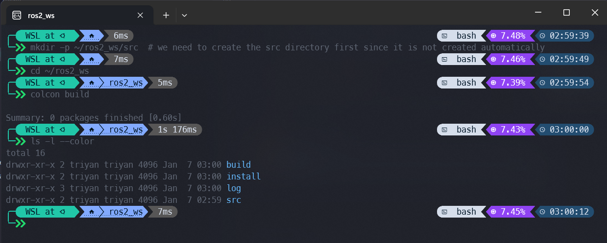
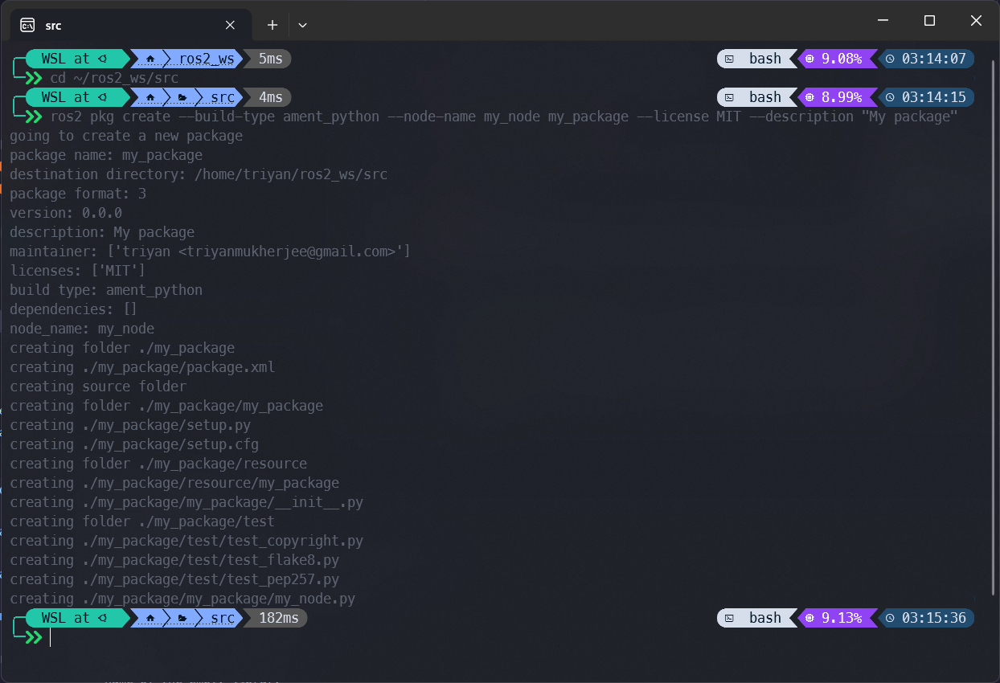
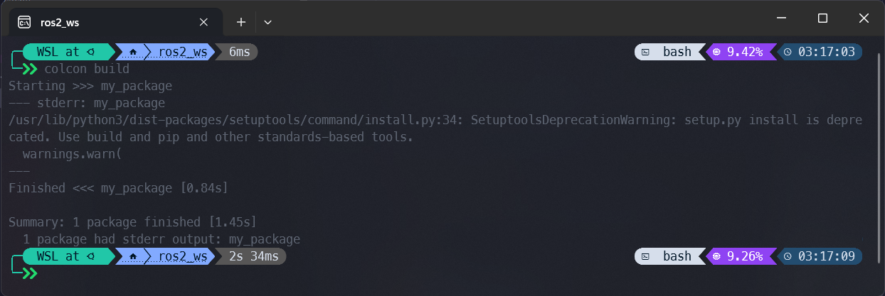
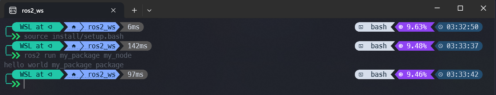
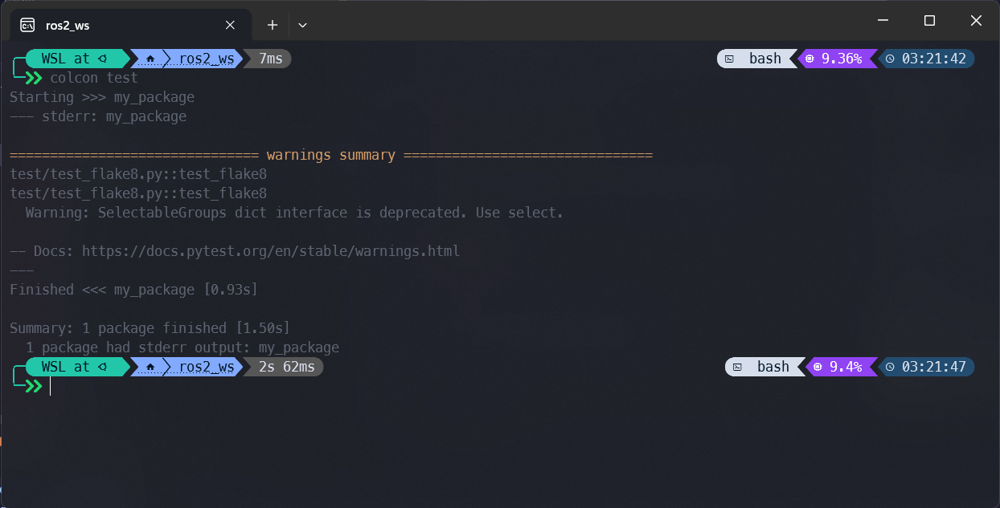

# Colcon for beginners

## What is colcon?

[Colcon](https://colcon.readthedocs.io/en/released/) is a command line tool to improve the workflow of building, testing and using multiple software packages. It automates the process, handles the ordering and sets up the environment to use the packages. It is a replacement for the old `catkin_make` and `catkin_tools` tools.

## How to install colcon?

Colcon is split into multiple packages. The core package is `colcon-core` and it is required to use colcon. The other packages are optional and provide additional functionality.

```bash
sudo apt install python3-colcon-common-extensions
```

The `colcon-common-extensions` package provides the most common extensions for colcon. It is recommended to install it.

!!! info "Autocompletes for colcon"
    To use the autocompletes for colcon run the following command:

    ```bash
    echo "source /usr/share/colcon_argcomplete/hook/colcon-argcomplete.bash" >> ~/.bashrc
    source ~/.bashrc
    ```

    You can use the autocompletes by pressing the ++tab++ key after typing `colcon` in the terminal.

## ROS 2 Workspace and Packages

Colcon uses a workspace to build and test packages. A workspace is a directory that contains multiple packages. The workspace is created with the `colcon build` command.

A ROS 2 workspace looks like this:

```
workspace
├── build
├── install
├── log
└── src
    ├── package_1
    ├── package_2
    └── package_3
```

- `build`: This directory contains the build files of the packages.
- `install`: This directory contains the installed packages.
- `log`: This directory contains the log files of the build and test process.
- `src`: This directory contains the source code of the packages. This is the directory where you put your packages and code.

## Create a ROS 2 Workspace

To create a workspace, use the following commands:

```bash
mkdir -p ~/ros2_ws/src  # we need to create the src directory first since it is not created automatically
cd ~/ros2_ws
colcon build
```



## Create a ROS 2 Package

A package is an organized collection of code in a ros2 workspace. A package can be installed, built, tested and used independently from other packages. A package can contain multiple nodes, libraries, executables, scripts, etc.

To create a package, use the following command:

=== "C++"
    ```bash
    cd ~/ros2_ws/src
    ros2 pkg create --build-type ament_cmake --node-name my_node my_package --license MIT --description "My package"
    ```

    Structure of a C++ package:

    ```
    my_package
    ├── CMakeLists.txt
    ├── include
    │   └── my_package
    │       └── my_node.hpp
    ├── package.xml
    ├── src
    │   └── my_node.cpp
    └── test
        └── test_my_node.cpp
    ```

    - `CMakeLists.txt`: This file contains the build instructions for the package.
    - `include`: This directory contains the header files of the package.
    - `package.xml`: This file contains the metadata of the package.
    - `src`: This directory contains the source files of the package.

=== "Python"
    ```bash
    cd ~/ros2_ws/src
    ros2 pkg create --build-type ament_python --node-name my_node my_package --license MIT --description "My package"
    ```

    Structure of a Python package:

    ```
    my_package
    ├── package.xml
    ├── setup.cfg
    ├── setup.py
    └── my_package
        ├── __init__.py
        ├── my_node.py
        └── test
            └── test_my_node.py
    ```

    - `package.xml`: This file contains the metadata of the package.
    - `setup.cfg`: This file contains the build instructions for the package.
    - `setup.py`: This file contains the build instructions for the package.
    - `my_package`: This directory contains the source files of the package.



!!! info "Multiple packages"
    You can create multiple packages in the `src` directory. The `colcon build` command will build all packages in the `src` directory.

## Build a ROS 2 Package

To build a package, use the following command:

```bash
cd ~/ros2_ws  # or cd .. if you are in the src directory
colcon build
```

Building a package will create the build files of the package in the `build` directory and the installed files of the package in the `install` directory.



!!! note "Build a single package"
    The `colcon build` command will build all packages in the workspace. To build a single package, use the `colcon build --packages-select my_package` command.
    Alternatively, you can use the `colcon build --packages-up-to my_package` command to build the specified package and all packages that it depends on.

## Run a ROS 2 Package

To run a package, use the following command:

```bash
cd ~/ros2_ws
source install/setup.bash  # source the setup file of the workspace
ros2 run my_package my_node
```

Sourcing the setup file of the workspace is required to set up the environment to use the packages in the workspace. It adds the executables in the `install` directory to your environment.

=== "C++"
    The `ros2 run my_package my_node` command will run the executable file of the node. The executable file is created in the `install` directory.

    

=== "Python"
    The `ros2 run my_package my_node` command will run the Python script of the node. The Python script is created in the `install` directory.

    

## Test a ROS 2 Package

To test a package, use the following command:

```bash
cd ~/ros2_ws
colcon test
```

The `colcon test` command will build and test all packages in the workspace. Testing a package is optional. It is not required to test a package to use it.



!!! note "Test a single package"
    The `colcon test` command will test all packages in the workspace. To test a single package, use the `colcon test --packages-select my_package` command.
    Alternatively, you can use the `colcon test --packages-up-to my_package` command to test the specified package and all packages that it depends on.
