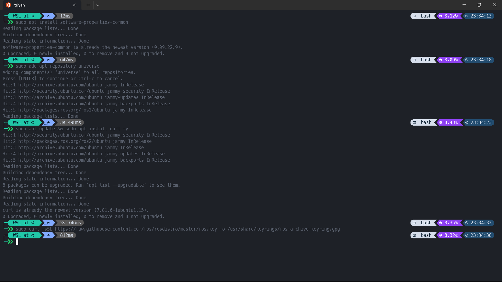
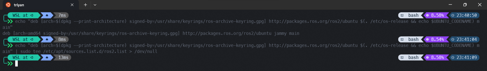
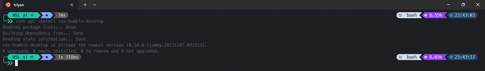
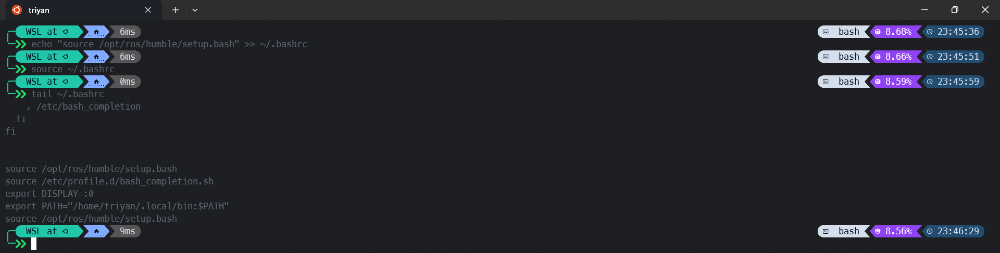
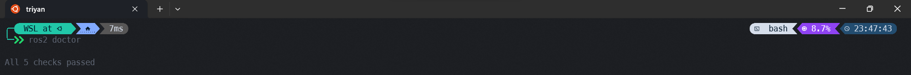
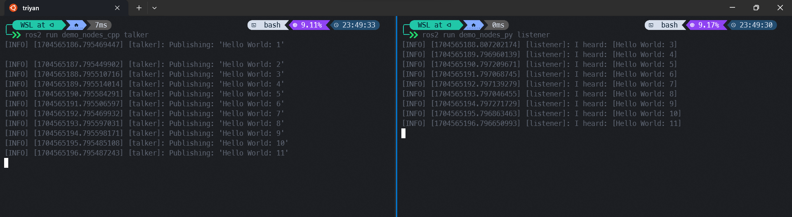

<h1 align="center">ROS2 Tutorials</h1>
<p align="center">
    
    <br /><br />
    The Robot Operating System (ROS) is a set of software libraries and tools for building robot applications.
    From drivers and state-of-the-art algorithms to powerful developer tools, ROS has the open source tools you need for your next robotics project.
    The official documentation for ROS2 and its distributions can be found <a href="https://index.ros.org/">here</a>.
</p>

!!! info "Note"
    This tutorial assumes that you have dual booted your system with Ubuntu 22.04 or have a [WSL2](https://ubuntu.com/tutorials/install-ubuntu-on-wsl2-on-windows-10#1-overview) installation of Ubuntu 22.04 on your Windows machine.

## Installation

To install ROS2, you need the `Ubuntu 22.04` Jammy Jellyfish release. You can download the ISO file from [here](https://releases.ubuntu.com/22.04/).

### Installing ROS2

Once you have installed Ubuntu 22.04, open a terminal instance and run the following commands:

```bash
sudo apt install software-properties-common  # install add-apt-repository
sudo add-apt-repository universe  # add universe repository
```

This will add the [universe repository](https://help.ubuntu.com/community/Repositories/Ubuntu) to your system. Now, run the following commands to install `curl` and add the ROS2 keyring to your system.

```bash
sudo apt update && sudo apt install curl -y  # update and install curl
sudo curl -sSL https://raw.githubusercontent.com/ros/rosdistro/master/ros.key -o /usr/share/keyrings/ros-archive-keyring.gpg  # add ROS2 keyring
```

!!! note "Note"
    A keyring is a collection of cryptographic keys that are stored in a file on your system. The keyring is used to verify the authenticity of the packages that you install on your system.
    Here, we are adding the ROS2 keyring to our system.



Now, add the ROS2 repository to your system and install ROS2.

```bash
echo "deb [arch=$(dpkg --print-architecture) signed-by=/usr/share/keyrings/ros-archive-keyring.gpg] http://packages.ros.org/ros2/ubuntu $(. /etc/os-release && echo $UBUNTU_CODENAME) main" | sudo tee /etc/apt/sources.list.d/ros2.list > /dev/null  # add ROS2 repository
sudo apt update && sudo apt upgrade  # update the package list and upgrade the packages
```

!!! note "Note"
    The `tee` command is used to write the output of a command to a file. Here, we are writing the ROS2 repository to the `/etc/apt/sources.list.d/ros2.list` file. The `> /dev/null` part is used to suppress the output of the command.



Now, install ROS2.

```bash
sudo apt install ros-humble-desktop  # install ROS2
```



With this, you have successfully installed ROS2 on your system. Now, you need to source the ROS2 setup file to your `.bashrc` file. This will allow you to use ROS2 commands in your terminal.

```bash
echo "source /opt/ros/humble/setup.bash" >> ~/.bashrc  # source the ROS2 setup file, run this only once
source ~/.bashrc  # source the .bashrc file, reloads the current terminal instance
tail ~/.bashrc  # check if the setup file has been sourced
```

!!! note "Note"
    The `>>` operator is used to append the output of a command to a file. Here, we are appending the `source /opt/ros/humble/setup.bash` command to the `.bashrc` file.
    `.bashrc` is a hidden file in your home directory that is executed every time you open a terminal instance.



Now, run the following command to check if ROS2 has been installed successfully.

```bash
ros2 doctor  # check if ROS2 has been installed successfully
```



### Running examples

Now, let's run some examples to check if ROS2 is working properly. Run the following commands to run the `talker` and `listener` examples.

```bash
ros2 run demo_nodes_cpp talker  # run the talker example
```

Now, open a new terminal instance and run the following command.

```bash
ros2 run demo_nodes_py listener  # run the listener example
```


