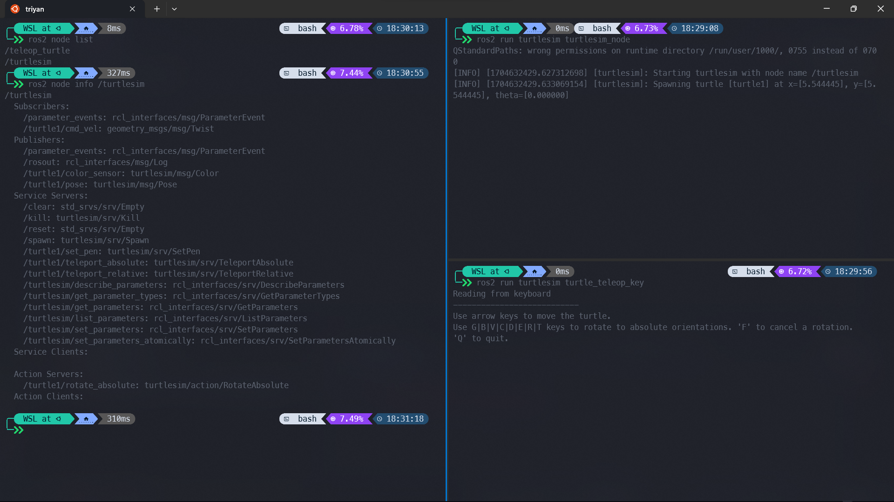
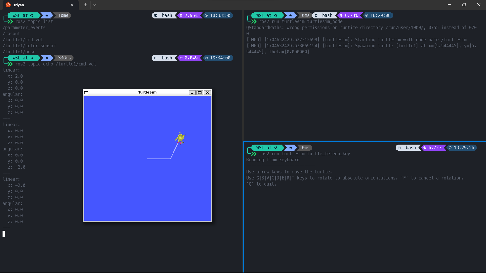
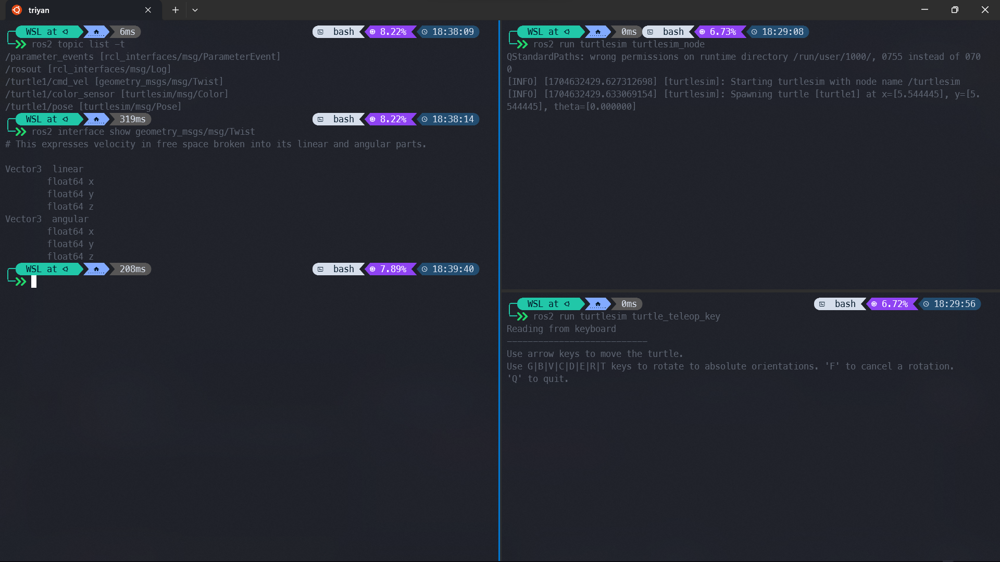
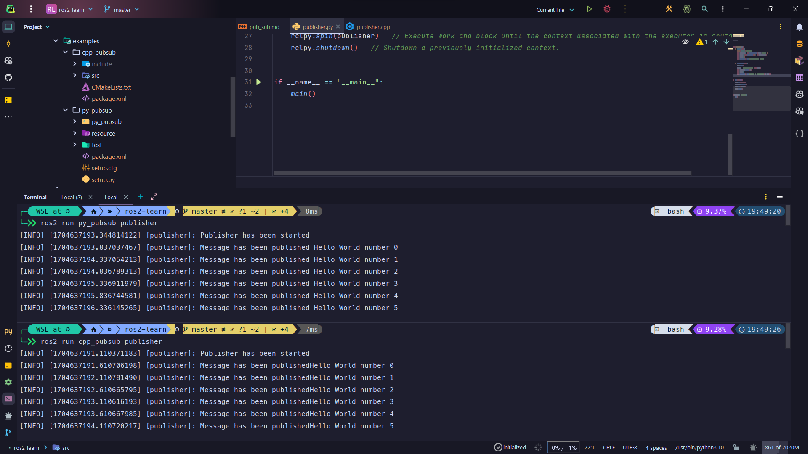
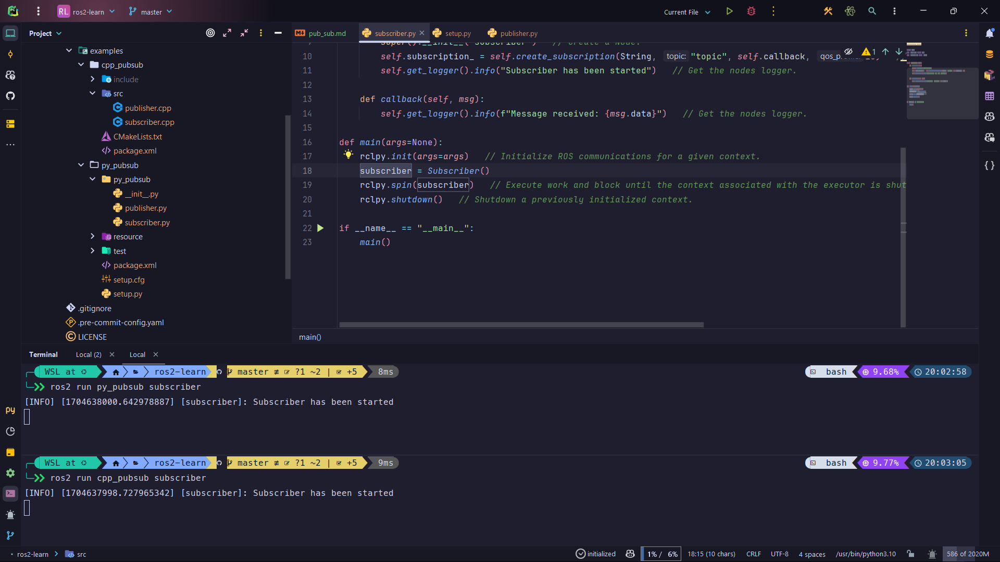
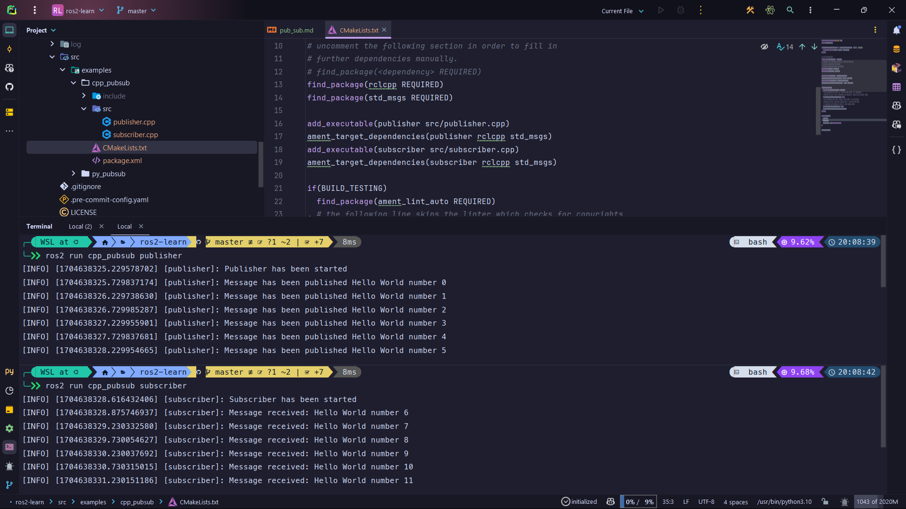

# Creating a Publisher and Subscriber

A publisher and subscriber consists of two [nodes](https://docs.ros.org/en/humble/Tutorials/Beginner-CLI-Tools/Understanding-ROS2-Nodes/Understanding-ROS2-Nodes.html) that communicate with each other over a [topic](https://docs.ros.org/en/humble/Tutorials/Beginner-CLI-Tools/Understanding-ROS2-Topics/Understanding-ROS2-Topics.html). The publisher sends messages to the topic, and the subscriber receives messages from the topic. The publisher and subscriber can be written in any language supported by ROS 2.

## Prerequisites

- [Creating and Managing Workspaces in ROS 2](./colcon.md)

A basic understanding of `python` or `C++` is recommended.

### What is a Node?

In ROS 2, a node is a process that performs computation. Each node is a single modular unit designed to perform a specific task. Nodes communicate with each other over topics, services, actions, and parameters. You can think of a node as a controller responsible for a specific task. For example, a node can be responsible for controlling a robot's wheels, or a node can be responsible for reading sensor data.

{ width=100% }

!!! info "List available Nodes"
    To list all available nodes, run the following command:

    ```bash
    ros2 node list
    ```

    To get information about a specific node, run the following command:

    ```bash
    ros2 node info /node_name_here
    ```

    

### What is a Topic?

A topic is a channel over which nodes communicate. A topic is a named bus over which nodes exchange messages. A node can publish messages to a topic, or a node can subscribe to a topic to receive messages. It is a crucial element that allows us to break down a complex system into smaller, more manageable parts.

A topic consists of a name, a type, and a message.

- The name is a string that identifies the topic.
- The type is the type of message that the topic will carry.
- The message is the actual data that is sent over the topic.

Nodes can publish messages to any number of topics and simultaneously subscribe to any number of topics. It can be one-to-one, one-to-many, many-to-one, or many-to-many communication.

{ width=100% }

!!! info "List available Topics"
    To list all available topics, run the following command:

    ```bash
    ros2 topic list
    ```

    To get information about a specific topic, run the following command:

    ```bash
    ros2 topic info /topic_name_here
    ```

    To get the message being transmitted over a specific topic, run the following command:

    ```bash
    ros2 topic echo /topic_name_here
    ```

    

    Each topic has a message type or structure associated with it. To get the message topics with their message types, run the following command:

    ```bash
    ros2 topic list -t
    ros2 interface show /topic_name_here
    ```

    

### What is a Message?

A message is a data structure that is sent over a topic. It is a simple data structure that consists of primitive data types such as integers, floats, strings, and arrays. A message can also contain other messages. A message is defined in the `msg` directory of the package. For example, the `std_msgs` package contains the `String` message type. The `String` message type is defined in the `msg` directory of the `std_msgs` package. To view the `String` message type, run the following command:

```bash
$ ros2 interface show std_msgs/msg/String

# This was originally provided as an example message.
# It is deprecated as of Foxy
# It is recommended to create your own semantically meaningful message.
# However if you would like to continue using this please use the equivalent in example_msgs.

string data
```

You can note all valid data types supported by ROS 2 [here](https://docs.ros.org/en/humble/Concepts/Basic/About-Interfaces.html).

To create custom messages, you would use the above data types to create your own message. We will cover this in a later tutorial.

## Creating a Publisher and Subscriber

Let's create a publisher and subscriber in `python` and `C++`. We will create a publisher that publishes a message to a topic, and a subscriber that subscribes to the topic and prints the message to the terminal.

Create a new package called `pub_sub`:

=== "Python"

    ```bash
    cd ~/ros2_ws/src
    ros2 pkg create --build-type ament_python py_pubsub
    ```

=== "C++"

    ```bash
    cd ~/ros2_ws/src
    ros2 pkg create --build-type ament_cmake cpp_pubsub
    ```

### Creating a Publisher

Publisher nodes publish messages to a topic. Let's create a publisher node that publishes a message to a topic called `topic`. Create a new file called `publisher.py` or `publisher.cpp` in the `py_pubsub` or `cpp_pubsub` package respectively.

=== "Python"

    ```bash
    cd ~/ros2_ws/src/py_pubsub/py_pubsub
    touch publisher.py
    ```

=== "C++"

    ```bash
    cd ~/ros2_ws/src/cpp_pubsub/src
    touch publisher.cpp
    ```

This is where we will write our publisher code. Open the file in your favorite editor and add the following imports:

=== "Python"

    ```python
    #!/usr/bin/env python3

    import rclpy
    from rclpy.node import Node
    from std_msgs.msg import String


    class Publisher(Node):
        def __init__(self):
            ...

        def timer_callback(self):
            ...


    def main(args=None):
        ...

    if __name__ == "__main__":
        main()
    ```

=== "C++"

    ```cpp
    #include <chrono>
    #include <functional>
    #include <memory>
    #include <string>

    #include "rclcpp/rclcpp.hpp"
    #include "std_msgs/msg/string.hpp"

    using namespace std::chrono_literals;


    class Publisher : public rclcpp::Node
    {
    public:
        Publisher() : Node("publisher")
        {
            ...
        }

    private:
        void timer_callback()
        {
            ...
        }

        rclcpp::Publisher<std_msgs::msg::String>::SharedPtr publisher_;
        rclcpp::TimerBase::SharedPtr timer_;
        size_t count_;
    };


    int main(int argc, char **argv)
    {
        ...
    }
    ```

Now try to create a publisher node by inheriting from the `Node` class. Feel free to come back and check the solution if you get stuck.

??? test "Source Code"

    === "Python"

        ```python
        #!/usr/bin/env python3

        import rclpy
        from rclpy.node import Node
        from std_msgs.msg import String

        class Publisher(Node):
            def __init__(self):
                super().__init__("publisher")
                self.publisher_ = self.create_publisher(String, "topic", 10)
                self.timer_ = self.create_timer(0.5, self.timer_callback)
                self.count_ = 0
                self.get_logger().info("Publisher has been started")

            def timer_callback(self):
                msg = String()
                msg.data = f"Hello World number {self.count_}"
                self.publisher_.publish(msg)
                self.count_ += 1
                self.get_logger().info(f"Message has been published {msg.data}")

        def main(args=None):
            rclpy.init(args=args)
            publisher = Publisher()
            rclpy.spin(publisher)
            rclpy.shutdown()

        if __name__ == "__main__":
            main()
        ```

        Here is the breakdown of the code:

        ```python
        class Publisher(Node):
            def __init__(self):
                super().__init__("publisher")
                self.publisher_ = self.create_publisher(String, "topic", 10)
                self.timer_ = self.create_timer(0.5, self.timer_callback)
                self.count_ = 0
                self.get_logger().info("Publisher has been started")
        ```

        - `class Publisher(Node)`: This line creates a class called `Publisher` that inherits from the `Node` class.
        - `super().__init__("publisher")`: This line calls the constructor of the `Node` class and passes the name of the node as an argument.
        - `self.publisher_ = self.create_publisher(String, "topic", 10)`: This line creates a publisher that publishes messages of type `String` to the topic called `topic`. The queue size is set to 10, this means that if the messages are published faster than they are being processed, the queue will store up to 10 messages before it starts to discard old ones.
        - `self.timer_ = self.create_timer(0.5, self.timer_callback)`: This line creates a timer that calls the `timer_callback` function every 0.5 seconds.

        ```python
        def timer_callback(self):
            msg = String()
            msg.data = f"Hello World number {self.count_}"
            self.publisher_.publish(msg)
            self.count_ += 1
            self.get_logger().info(f"Message has been published {msg.data}")
        ```

        - `msg = String()`: This line creates a new message of type `String`.
        - `msg.data = "Hello World!"`: This line sets the message data to "Hello World!".
        - `self.publisher_.publish(msg)`: This line publishes the message to the topic.

        ```python
        def main(args=None):
            rclpy.init(args=args)
            publisher = Publisher()
            rclpy.spin(publisher)
            rclpy.shutdown()
        ```

        - `rclpy.init(args=args)`: This line initializes the ROS 2 client library.
        - `publisher = Publisher()`: This line creates an instance of the `Publisher` class.
        - `rclpy.spin(publisher)`: This line starts the node. It will keep the node running until it is shutdown.
        - `rclpy.shutdown()`: This line shuts down the ROS 2 client library.

    === "C++"

        ```cpp
        #include <chrono>
        #include <functional>
        #include <memory>
        #include <string>

        #include "rclcpp/rclcpp.hpp"
        #include "std_msgs/msg/string.hpp"

        using namespace std::chrono_literals;

        class Publisher : public rclcpp::Node
        {
        public:
            Publisher() : Node("publisher")
            {
                publisher_ = this->create_publisher<std_msgs::msg::String>("topic", 10);
                timer_ = this->create_wall_timer(500ms, std::bind(&Publisher::timer_callback, this));
                count_ = 0;
                RCLCPP_INFO(this->get_logger(), "Publisher has been started");
            }

        private:
            void timer_callback()
            {
                auto msg = std_msgs::msg::String();
                msg.data = "Hello World number " + std::to_string(count_++);
                publisher_->publish(msg);
                RCLCPP_INFO(this->get_logger(), ("Message has been published" + msg.data).c_str());
            }

            rclcpp::Publisher<std_msgs::msg::String>::SharedPtr publisher_;
            rclcpp::TimerBase::SharedPtr timer_;
            size_t count_;
        };

        int main(int argc, char **argv)
        {
            rclcpp::init(argc, argv);
            auto publisher = std::make_shared<Publisher>();
            rclcpp::spin(publisher);
            rclcpp::shutdown();
            return 0;
        }
        ```

        Here is the breakdown of the code:

        ```cpp
        class Publisher : public rclcpp::Node
        {
        public:
            Publisher() : Node("publisher")
            {
                publisher_ = this->create_publisher<std_msgs::msg::String>("topic", 10);
                timer_ = this->create_wall_timer(500ms, std::bind(&Publisher::timer_callback, this));
                count_ = 0;
                RCLCPP_INFO(this->get_logger(), "Publisher has been started");
            }
        ```

        - `class Publisher : public rclcpp::Node`: This line creates a class called `Publisher` that inherits from the `Node` class.
        - `Publisher() : Node("publisher")`: This line calls the constructor of the `Node` class and passes the name of the node as an argument.
        - `publisher_ = this->create_publisher<std_msgs::msg::String>("topic", 10)`: This line creates a publisher that publishes messages of type `String` to the topic called `topic`. The queue size is set to 10, this means that if the messages are published faster than they are being processed, the queue will store up to 10 messages before it starts to discard old ones.

        ```cpp
        void timer_callback()
        {
            auto msg = std_msgs::msg::String();
            msg.data = "Hello World number " + std::to_string(count_++);
            publisher_->publish(msg);
            RCLCPP_INFO(this->get_logger(), ("Message has been published" + msg.data).c_str());
        }
        ```

        - `auto msg = std_msgs::msg::String()`: This line creates a new message of type `String`.
        - `msg.data = "Hello World!"`: This line sets the message data to "Hello World!".
        - `publisher_->publish(msg)`: This line publishes the message to the topic.

        ```cpp
        int main(int argc, char **argv)
        {
            rclcpp::init(argc, argv);
            auto publisher = std::make_shared<Publisher>();
            rclcpp::spin(publisher);
            rclcpp::shutdown();
            return 0;
        }
        ```

        - `rclcpp::init(argc, argv)`: This line initializes the ROS 2 client library.
        - `auto publisher = std::make_shared<Publisher>()`: This line creates an instance of the `Publisher` class.
        - `rclcpp::spin(publisher)`: This line starts the node. It will keep the node running until it is shutdown.
        - `rclcpp::shutdown()`: This line shuts down the ROS 2 client library.

#### Adding Dependencies and Installing the Package

Now we need to add the dependencies to the `package.xml` file. Open the `package.xml` file and add the following dependencies:

=== "Python"

    ```xml
    <build_depend>rclpy</build_depend>
    <exec_depend>rclpy</exec_depend>
    <exec_depend>std_msgs</exec_depend>
    ```

    `rclpy` is the ROS 2 client library for `python`. `std_msgs` is the package that contains the `String` message type.

=== "C++"

    ```xml
    <build_depend>rclcpp</build_depend>
    <exec_depend>rclcpp</exec_depend>
    <exec_depend>std_msgs</exec_depend>
    ```

    `rclcpp` is the ROS 2 client library for `C++`. `std_msgs` is the package that contains the `String` message type.

Now we need to make this script executable.

=== "Python"

    In python to allow the script to be executable, we need to edit `setup.py` file and add the following line:

    ```python
    entry_points={
        "console_scripts": [
            "publisher = py_pubsub.publisher:main"
        ],
    },
    ```

    This will create a script called `publisher` that will run the `main` function in the `publisher.py` file.

=== "C++"

    In C++ to allow the script to be executable, we need to edit `CMakeLists.txt` file and add the following lines:

    ```cmake
    find_package(rclcpp REQUIRED)  # To use the rclcpp library
    find_package(std_msgs REQUIRED)  # To use the String message type

    add_executable(publisher src/publisher.cpp)
    ament_target_dependencies(publisher rclcpp std_msgs)
    install(TARGETS publisher DESTINATION lib/${PROJECT_NAME})
    ```

    This will create an executable called `publisher` that will run the `main` function in the `publisher.cpp` file.

Now we need to build and install the package, to verify that everything is working as expected. Run the following commands:

```bash
cd ~/ros2_ws
colcon build
source install/setup.bash
```

Now run the following command to run the publisher:

=== "Python"

    ```bash
    ros2 run py_pubsub publisher
    ```

=== "C++"

    ```bash
    ros2 run cpp_pubsub publisher
    ```



### Creating a Subscriber

Subscriber nodes subscribe to a topic to receive messages. Let's create a subscriber node that subscribes to the topic called `topic`. Create a new file called `subscriber.py` or `subscriber.cpp` in the `py_pubsub` or `cpp_pubsub` package respectively.

=== "Python"

    ```bash
    cd ~/ros2_ws/src/py_pubsub/py_pubsub
    touch subscriber.py
    ```

=== "C++"

    ```bash
    cd ~/ros2_ws/src/cpp_pubsub/src
    touch subscriber.cpp
    ```

This is where we will write our subscriber code. Open the file in your favorite editor and add the following imports:

=== "Python"

    ```python
    #!/usr/bin/env python3

    import rclpy
    from rclpy.node import Node
    from std_msgs.msg import String


    class Subscriber(Node):
        def __init__(self):
            ...

        def callback(self, msg):
            ...


    def main(args=None):
        ...


    if __name__ == "__main__":
        main()
    ```

=== "C++"

    ```cpp
    #include <chrono>
    #include <functional>
    #include <memory>
    #include <string>

    #include "rclcpp/rclcpp.hpp"
    #include "std_msgs/msg/string.hpp"

    using namespace std::chrono_literals;


    class Subscriber : public rclcpp::Node
    {
    public:
        Subscriber() : Node("subscriber")
        {
            ...
        }

    private:
        void callback(const std_msgs::msg::String::SharedPtr msg)
        {
            ...
        }

        rclcpp::Subscription<std_msgs::msg::String>::SharedPtr subscription_;
    };


    int main(int argc, char **argv)
    {
        ...
    }
    ```

Now try to create a subscriber node by inheriting from the `Node` class. Feel free to come back and check the solution if you get stuck.

??? test "Source Code"

    === "Python"

        ```python
        #!/usr/bin/env python3

        import rclpy
        from rclpy.node import Node
        from std_msgs.msg import String

        class Subscriber(Node):
            def __init__(self):
                super().__init__("subscriber")
                self.subscription_ = self.create_subscription(String, "topic", self.callback, 10)
                self.get_logger().info("Subscriber has been started")

            def callback(self, msg):
                self.get_logger().info(f"Message received: {msg.data}")

        def main(args=None):
            rclpy.init(args=args)
            subscriber = Subscriber()
            rclpy.spin(subscriber)
            rclpy.shutdown()

        if __name__ == "__main__":
            main()
        ```

        Here is the breakdown of the code:

        ```python
        class Subscriber(Node):
            def __init__(self):
                super().__init__("subscriber")
                self.subscription_ = self.create_subscription(String, "topic", self.callback, 10)
                self.get_logger().info("Subscriber has been started")
        ```

        - `class Subscriber(Node)`: This line creates a class called `Subscriber` that inherits from the `Node` class.
        - `super().__init__("subscriber")`: This line calls the constructor of the `Node` class and passes the name of the node as an argument.
        - `self.subscription_ = self.create_subscription(String, "topic", self.callback, 10)`: This line creates a subscriber that subscribes to the topic called `topic` and calls the `callback` function when a message is received. The queue size is set to 10, this means that if the messages are published faster than they are being processed, the queue will store up to 10 messages before it starts to discard old ones.

        ```python
        def callback(self, msg):
            self.get_logger().info(f"Message received: {msg.data}")
        ```

        - `self.get_logger().info(f"Message received: {msg.data}")`: This line prints the message data to the terminal.

        ```python
        def main(args=None):
            rclpy.init(args=args)
            subscriber = Subscriber()
            rclpy.spin(subscriber)
            rclpy.shutdown()

        if __name__ == "__main__":
            main()
        ```

        - `rclpy.init(args=args)`: This line initializes the ROS 2 client library.
        - `subscriber = Subscriber()`: This line creates an instance of the `Subscriber` class.
        - `rclpy.spin(subscriber)`: This line starts the node. It will keep the node running until it is shutdown.
        - `rclpy.shutdown()`: This line shuts down the ROS 2 client library.

    === "C++"

        ```cpp
        #include <chrono>
        #include <functional>
        #include <memory>
        #include <string>

        #include "rclcpp/rclcpp.hpp"
        #include "std_msgs/msg/string.hpp"

        using namespace std::chrono_literals;

        class Subscriber : public rclcpp::Node
        {
        public:
            Subscriber() : Node("subscriber")
            {
                subscription_ = this->create_subscription<std_msgs::msg::String>("topic", 10, std::bind(&Subscriber::callback, this, std::placeholders::_1));
                RCLCPP_INFO(this->get_logger(), "Subscriber has been started");
            }

        private:
            void callback(const std_msgs::msg::String::SharedPtr msg)
            {
                RCLCPP_INFO(this->get_logger(), ("Message received: " + msg->data).c_str());
            }

            rclcpp::Subscription<std_msgs::msg::String>::SharedPtr subscription_;
        };

        int main(int argc, char **argv)
        {
            rclcpp::init(argc, argv);
            auto subscriber = std::make_shared<Subscriber>();
            rclcpp::spin(subscriber);
            rclcpp::shutdown();
            return 0;
        }
        ```

        Here is the breakdown of the code:

        ```cpp
        class Subscriber : public rclcpp::Node
        {
        public:
            Subscriber() : Node("subscriber")
            {
                subscription_ = this->create_subscription<std_msgs::msg::String>("topic", 10, std::bind(&Subscriber::callback, this, std::placeholders::_1));
                RCLCPP_INFO(this->get_logger(), "Subscriber has been started");
            }
        ```

        - `class Subscriber : public rclcpp::Node`: This line creates a class called `Subscriber` that inherits from the `Node` class.
        - `Subscriber() : Node("subscriber")`: This line calls the constructor of the `Node` class and passes the name of the node as an argument.
        - `subscription_ = this->create_subscription<std_msgs::msg::String>("topic", 10, std::bind(&Subscriber::callback, this, std::placeholders::_1))`: This line creates a subscriber that subscribes to the topic called `topic` and calls the `callback` function when a message is received. The queue size is set to 10, this means that if the messages are published faster than they are being processed, the queue will store up to 10 messages before it starts to discard old ones.

        ```cpp
        void callback(const std_msgs::msg::String::SharedPtr msg)
        {
            RCLCPP_INFO(this->get_logger(), ("Message received: " + msg->data).c_str());
        }
        ```

        - `RCLCPP_INFO(this->get_logger(), ("Message received: " + msg->data).c_str())`: This line prints the message data to the terminal.

        ```cpp
        int main(int argc, char **argv)
        {
            rclcpp::init(argc, argv);
            auto subscriber = std::make_shared<Subscriber>();
            rclcpp::spin(subscriber);
            rclcpp::shutdown();
            return 0;
        }
        ```

        - `rclcpp::init(argc, argv)`: This line initializes the ROS 2 client library.
        - `auto subscriber = std::make_shared<Subscriber>()`: This line creates an instance of the `Subscriber` class.
        - `rclcpp::spin(subscriber)`: This line starts the node. It will keep the node running until it is shutdown.
        - `rclcpp::shutdown()`: This line shuts down the ROS 2 client library.

#### Adding Dependencies and Installing the Package

Since we have already added the dependencies in the previous section, we can skip this step.

Now we need to make this script executable.

=== "Python"

    In python to allow the script to be executable, we need to edit `setup.py` file and add the following line:

    ```python
    entry_points={
        "console_scripts": [
            "publisher = py_pubsub.publisher:main",
            "subscriber = py_pubsub.subscriber:main"
        ],
    },
    ```

    This will create a script called `subscriber` that will run the `main` function in the `subscriber.py` file.

=== "C++"

    In C++ to allow the script to be executable, we need to edit `CMakeLists.txt` file and add the following lines:

    ```cmake
    find_package(rclcpp REQUIRED)  # To use the rclcpp library
    find_package(std_msgs REQUIRED)  # To use the String message type

    add_executable(publisher src/publisher.cpp)
    ament_target_dependencies(publisher rclcpp std_msgs)

    add_executable(subscriber src/subscriber.cpp)
    ament_target_dependencies(subscriber rclcpp std_msgs)
    install(TARGETS publisher subscriber DESTINATION lib/${PROJECT_NAME})
    ```

    This will create an executable called `subscriber` that will run the `main` function in the `subscriber.cpp` file.

Now we need to build and install the package, to verify that everything is working as expected. Run the following commands:

```bash
cd ~/ros2_ws
colcon build
source install/setup.bash
```

Now run the following command to run the subscriber:

=== "Python"

    ```bash
    ros2 run py_pubsub subscriber
    ```

=== "C++"

    ```bash
    ros2 run cpp_pubsub subscriber
    ```



### Running the Publisher and Subscriber

Now that we have created the publisher and subscriber, let's run them together. Open two terminals and run the following commands:

=== "Python"

    ```bash
    ros2 run py_pubsub publisher
    ```

    ```bash
    ros2 run py_pubsub subscriber
    ```

    

=== "C++"

    ```bash
    ros2 run cpp_pubsub publisher
    ```

    ```bash
    ros2 run cpp_pubsub subscriber
    ```

    

## Summary

Congratulations! You have successfully created a publisher and subscriber in `python` and `C++`. You can find the source code for this tutorial [here](https://github.com/RoboManipal/Learn-ROS2/tree/master/src/examples).
