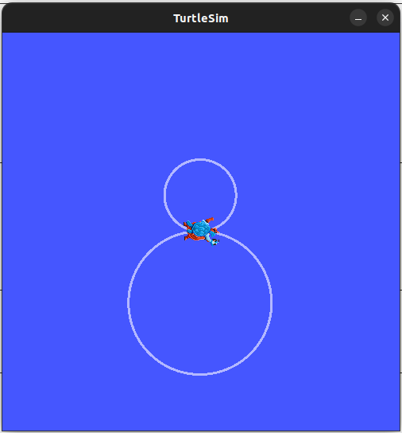

# Turtlesim For Beginners

## What is turtlesim?

Turtlesim is a lightweight simulator for learning ROS 2. It illustrates what ROS 2 does at the most basic level to give you an idea of what you will do with a real robot or a robot simulation later on.

The ros2 tool is how the user manages, introspects, and interacts with a ROS system. It supports multiple commands that target different aspects of the system and its operation. One might use it to start a node, set a parameter, listen to a topic, and many more. The ros2 tool is part of the core ROS 2 installation.

## How to install Turtlesim


```bash
sudo apt install ros-humble-turtlesim
```
Check that the package is installed:

```bash
ros2 pkg executables turtlesim
```
The above command should return a list of turtlesim’s executables:

```bash
turtlesim draw_square
turtlesim mimic
turtlesim turtle_teleop_key
turtlesim turtlesim_node
```

## Start Turtlesim
To start turtlesim, enter the following command in your terminal:

```bash
ros2 run turtlesim turtlesim_node
```
The simulator window should appear, with a random turtle in the center.


## Use Turtlesim

Now you will run a new node to control the turtle in the first node:

```bash
ros2 run turtlesim turtle_teleop_key
```
Use the arrow keys on your keyboard to control the turtle. It will move around the screen, using its attached “pen” to draw the path it followed so far.

### Operating the turtle using a script
To move the turtle using a python or C++ script , create a publisher to the turtle1/cmd_vel topic and the message type is Twist.

Import twist from the geometry_msgs package:
=== "Python"

    ```python
    from geometry_msgs.msg import Twist
    ```
=== "C++"
    ```cpp
    #include "geometry_msgs/msg/Twist.hpp"
    ```
Message type Twist has the following datatypes:
```
Vector3  linear
    -float64 x
    -float64 y
    -float64 z
Vector3  angular
    -float64 x
    -float64 y
    -float64 z
```

To create a publisher of message type Twist:

=== "Python"

    ```python
    self.pub1=self.create_publisher(Twist,'turtle1/cmd_vel',10)
    ```
=== "C++"
    ```cpp
    publisher_ = this->create_publisher<geometry_msgs::msg::Twist>("topic", 10);
    ```

### Obtaining information about the Pose of the turtle
To obtain the pose of the turtle subscribe to the turtle1/pose topic and the message type being Pose

Import Pose from the turtlesim package:
=== "Python"

    ```python
    from turtlesim.msg import Pose
    ```
=== "C++"
    ```cpp
    #include "turtlesim/msg/Pose.hpp"
    ```
Message type Pose has the following datatypes:
```
float32 x
float32 y
float32 theta

float32 linear_velocity
float32 angular_velocity
```

To create a subscriber of message type Pose:

=== "Python"

    ```python
    self.sub=self.create_subscription(Pose,'turtle1/pose',self.callback,1)
    ```
=== "C++"
    ```cpp
    subscription_ = this->create_subscription<turtlesim::msg::Pose>(
      "topic", 10, std::bind(&MinimalSubscriber::topic_callback, this, _1));
    ```

### Running an example script
In this example we will run an example script that draws a snowman in turtlesim.

First make sure you have added the python executable to setup.py or the cpp executable to CMakeLists.txt.

Here the name of the executable is snowman and the package is py_pubsub

First run the turtlesim node
```bash
ros2 run turtlesim turtlesim_node
```

Then run the executable
```bash
ros2 run py_pubsub snowman
```
Here is the expected output


